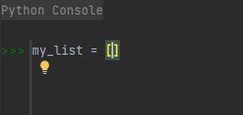
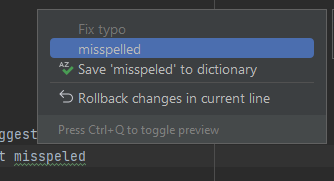

# Table of contents
<!-- TOC -->
* [Table of contents](#table-of-contents)
* [IDE conventions](#ide-conventions)
  * [IDE Version](#ide-version)
  * [Plugins](#plugins)
  * [Coding Style and Formatting](#coding-style-and-formatting)
  * [Debugger](#debugger)
    * [Debugger basic instructions](#debugger-basic-instructions)
      * [Launching Debugger](#launching-debugger)
      * [Stops](#stops)
      * [Inspecting variables](#inspecting-variables)
      * [Jumping in execution flow](#jumping-in-execution-flow)
  * [GIT](#git)
  * [Refactoring Tools](#refactoring-tools)
  * [Code Analysis Tool](#code-analysis-tool)
  * [Venv](#venv)
  * [Build-in terminal](#build-in-terminal)
  * [Tips](#tips)
    * [Code folding](#code-folding)
    * [Search anywhere](#search-anywhere)
    * [Use Python console](#use-python-console)
    * [Configure interpreter](#configure-interpreter)
    * [Configuring docstrings](#configuring-docstrings)
    * [Check spelling](#check-spelling)
    * [Context actions](#context-actions)
    * [Configure appearance](#configure-appearance)
    * [Jumps](#jumps)
    * [Documentations tips](#documentations-tips)
<!-- TOC -->

---

# IDE conventions

You can write in any IDE you like, including opening Python-files in command-prompt or using simplest text-editors,
as long as no one sees that. **But the main IDE, that you should use when working with Python-code is PyCharm**.

PyCharm has several advantages:

- It provides an easy way to follow PEPs, including checking styles dynamically
- It provides dynamic type-checking
- It has a build-in Debugger
- It can warn you about some implicit errors, before the code is executed
- It has build-in code navigation
- It has build-in refactoring tools
- It has a very good 'Search everywhere' mechanism
- ...

All these and many other functions of PyCharm are not only convenient way to work with code, but, most importantly,
can minimize a chance of an error.

Using a single IDE each time also provide a way to standardize code style: while consistently using the same IDE 
to work in, you will face the same difficulties and advantages each time, which will soft-force you to write 
in the same style.

The good illustration are docstrings: PyCharm can fold docstrings with the single key-combination (Ctrl+Shift+Num-).
This let you write as long docstrings, as you like, and fold them if not needed. Working with such long docstrings
in some IDE, that can not fold it, or working in IDE, that requires more complicated way to handle folding will 
result in a desire not to write docstrings.

---

## IDE Version

* [Table of contents](#table-of-contents)

Currently, the minimum version, that have all the functionality, required to follow all conventions is:

> 2023.1.2 Community Edition

You can use any newer version of PyCharm, but it is recommended to update to at least this release.

---

## Plugins

* [Table of contents](#table-of-contents)

Consider installing:

1. Docker plugin
2. Spell checking support for Russian (or any other language, that your project uses)

---

## Coding Style and Formatting

* [Table of contents](#table-of-contents)

PyCharm provides a build-in mechanism to check coding styles and formatting, that can be configured. Preconfigured
formatting are recommended to be used. If any of the preconfigured styles are come into conflict with any of these
style-guides - it is recommended to turn them off manually, not to see unwanted warns.

The basic idea is to run PyCharm's code inspections (including dynamic), and see no warnings, including any spell
checking.

---

## Debugger

* [Table of contents](#table-of-contents)

PyCharm provides one of the best debugger, that let you execute code with stops, change variable dynamically or
get any variables values and jump into/from nested code execution.

### Debugger basic instructions

#### Launching Debugger

* [Table of contents](#table-of-contents)

Launching code execution in Debugger not differ much from regular code execution. By default, Debugger works in the
same environment, as configured for the simple PyCharm's 'Run'. To execute specific file in debugger:

1. Select a file, that you want to execute, in PyCharm's catalogue
2. Right-click on that file
3. Select 'Debugger <file_name>'

> 

#### Stops

* [Table of contents](#table-of-contents)

The most useful feature are 'stops'. These are design to let you pause code execution, and check any values in
your interpreters memory. To set up a stop:

1. Locate a place (line), where you want interpreter to pause
2. Click on the line number
3. Stop will be illustrated as a red circle, selected line will appear red

> 

#### Inspecting variables

* [Table of contents](#table-of-contents)

When you have paused your code execution, you can check any variables values.

> 

You can inspect all the variables, available in memory at this moment. Note, that the line, at which you paused
interpreter, is **NOT executed**, and all the lines before the one you paused at, are.

#### Jumping in execution flow

* [Table of contents](#table-of-contents)

You can continue execution of the code in 4 ways:

1. Make a next stop and jump there
2. Execute the current line and get to the next one
3. Jump into nested code (e.g. into a function/method)
4. Jump from the nested code to one level up

To do that, use these buttons:

> 

---

## GIT

* [Table of contents](#table-of-contents)

PyCharm has a complex build-in Version Control System (VCS), which can be used to make any changes to repos, you are
working with, along with manually controlling your repos in any console you like. While using PyCharm, you should be
aware about its '.idea' folder, which is created automatically.

This folder contains you personal settings, and **MUST NEVER be indexed by GIT**. You should add this folder 
to '.gitignore' file, before making any commits.

```gitignore
/.idea/
```
Feel free to use PyCharm's build-in VCS, including:

- Making commits
- Pulling updates and new repos
- Creating repos
- Merging
- Checking-in system
- Creating and deleting branches
- All other stuff, that PyCharm provides in its beautiful VCS!


## Refactoring Tools

* [Table of contents](#table-of-contents)

PyCharm provide a convince mechanism of refactoring, which is mainly used to change names of variables, files, 
classes, functions and methods. This mechanism works almost flawless in relation to Python's object, but can 
often fail in refactoring files, folders or modules.

You can and should use this mechanism, as it lowers the potential error, but should as well always check the results.
To do that, consider these 2 approaches:

1. Checking manually what PyCharm sees, as a source of refactoring
2. Use PyCharm's 'search anywhere' mechanism, to check the results

This 2 approaches should be performed together. Pay a close attention to changing file-names and moving existing files,
as PyCharm often fails to change imports and file-paths properly (especially if you use stringed file-path).

## Code Analysis Tool

* [Table of contents](#table-of-contents)

PyCharm has a pretty nice and efficient set of tools for automatic analysis of your code, one of them is 'Problems'
tab. You should consider using this tool occasionally, especially before making any commits. This toll does not
guarantee complete inspection, but can track most of the middle to extreme warnings.

## Venv

You should always create venv for all of your projects and install new libraries, required for each of them, there.
This will not only prevent versions-conflicts, but will make it easier for you to make requirements.txt for 
your project.

## Build-in terminal

* [Table of contents](#table-of-contents)

Feel free to use PyCharm's build-in terminal system, including switching between different supported command prompts.
The only issue that you can face is tracking, if venv was activated or not. Check if PyCharm's terminal had
activated venv by visually inspecting the path in command prompt:

```
(venv) C:\Users\...   <- venv is activated
  ↑

C:\Users\...          <- venv is NOT activated
```

If PyCharm fails to activate venv, check if the 'venv' folder exists and is recognized as venv in PyCharm's settings.
Then, consider open a new terminal. If it does not help, try to relaunch PyCharm (often helps on Windows). If both
these did not help - try troubleshooting by searching web or asking ChatGPT for help.

## Tips

* [Table of contents](#table-of-contents)

Here are some tips, that you may find useful!

### Code folding

* [Table of contents](#table-of-contents)

Feel free to fold any code by clicking Ctrl+Shift+Num-. By default, this will fold all the code in a specific file.
You can unfold segments you need after that. You can also fold segment manually, which includes folding docstrings, 
individual classes, methods or functions.

An example of folded code segment (methods):

> 

### Search anywhere

* [Table of contents](#table-of-contents)

To can invoke 'search anywhere' window, by double-clicking L-shift. This is one of the most used tool in PyCharm by
any developer. You can either search in the main section (All) or get to the 'Files' section, to search all your code
specifically. The last one is much more powerful toll to search for segments of the written code. You can further 
expand this tab into a split-screen, to make search more convenient:

> 

### Use Python console

* [Table of contents](#table-of-contents)

There are 2 main ways to check how a particular piece of code behaves, before implementing it into your code-base:

1. Make a separate test-file, to write a segment of code and execute it
2. Use Python-console

Both approaches are logit, but in case of smaller questions, that you might want to address to Python's behavior, you
can use PyCharm's build-in Python-console. It works as an interactive interpreter, where you can declare variables
and check what different methods do.

Consider such example:

> > I have completely forgotten, how to add elements into a list! I do remember, that there was some method, but what
> > was its name...?

Open up a console, declare your variable with a list in it and press enter:

> 

Now, use that variable, to see al of its methods, that PyCharm will automatically show to you, as you start typing:

> 

> > Aha! It is 'append()'!

### Configure interpreter

* [Table of contents](#table-of-contents)

PyCharm provides a mechanism for configuring your interpreter. One of the most valuable feature is setting environmental
variables. You can do so, by simply adding them as a pairs of key-values:

> 

### Configuring docstrings

* [Table of contents](#table-of-contents)

As docstrings are an essential part of the Guidelines, you would need PyCharm to treat selected style for docstrings
correctly. To do so, you can configure them here:

> Settings -> Tools -> Python integrated tools -> Docstring -> Google

After specifying your desired format for Docstrings, PyCharm will provide you with autofill on each new Docstring and
will recognize this type of Docstrings, which will add typehints to the code you are working with.

### Check spelling

Spelling is the essential part of coding, as Pythons code itself is a scripted text. Take time to check your code
for spelling, by using PyCharm's integrated spell-checker. On each file, you will get a hint in the up-right corner,
which, if clicked, will open up spell-checker:

> 

### Context actions

* [Table of contents](#table-of-contents)

PyCharm has a complex and powerful tool, called 'Context Actions'. It allows you to make automatic refactoring of any
type, each time PyCharm sees an error. This includes:

- Wrong imports
- Wrong variable names
- Spelling
- etc.

Each time you see any type of warning, you can press place a cursor onto it and press Alt+Enter, to get PyCharm's 
automatic suggestions. For example, during writing of this text, Author used this combination infinite number 
of times, to correct misspelled words and more:

> 

### Configure appearance

* [Table of contents](#table-of-contents)

PyCharm has a set of build-in themes, that you can use to make working more comfortable. Feel free to use all of 
these features in:

> Settings -> Appearance & behaviour

### Jumps

* [Table of contents](#table-of-contents)

If you see some function/method/class, which source-code you want to look at, you can press Ctrl+LMB, which will
transfer you to its source. This works in reverse as well: by clicking on some declaration, you can see each place, 
where it was used, which includes variables, attributes, classes, methods (including __init__ only) and more.

### Documentations tips

* [Table of contents](#table-of-contents)

If any variable/instance/link/etc. have any kind of supported documentations, you can see it from anywhere, 
which can often clarify things. To do so, you can hover your mouse over any object, to open up its documentation:

> 